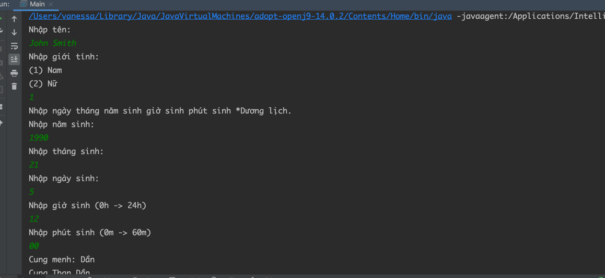

Tử vi đẩu số tân biên: App Java dành cho người Việt Nam

Với tâm huyết lập 1 ứng dụng miễn phí, với mục đích là đem kiến thức tử vi đến cho người sử dụng, 
mình làm ứng dụng Java này, simple để có thể tạo lá số, đọc được lá số theo cuốn sách Tử Vi Đẩu số 
tân biên của Thái Thứ Lang.

References:

https://lykhi.com/7-buoc-lap-la-so-tu-vi-day-du-va-chi-tiet-tu-a-z/

How to play:

Clone this project.

Navigate to Main and play it.

****